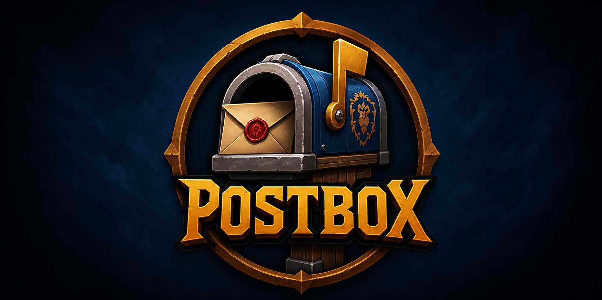
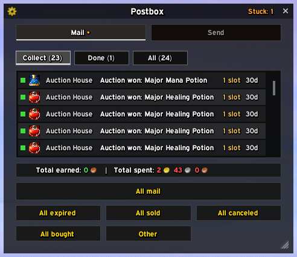
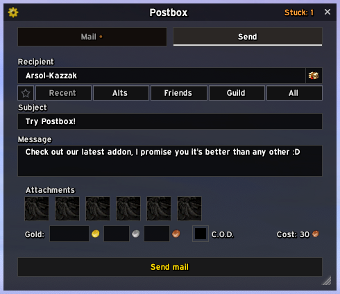
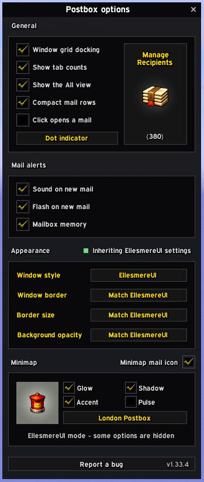

  

**Postbox is a modern, lightweight replacement for the default World of Warcraft
mailbox** — one window that opens automatically at any mailbox, clears a full inbox
in one pass, and remembers everyone you write to.

For retail (Midnight, 12.0.x–12.1). No dependencies, nothing to configure — install
it and open a mailbox.

## What it does

- **Empties a full mailbox in one click** — and does it safely. Every server command
  is confirmed before the next is sent, items the server refuses are skipped instead
  of ending the run, and if something genuinely can't be collected, Postbox tells
  you why in the game's own words instead of failing silently.
- **Knows who you mail.** Start typing a name and it completes in place — Tab
  accepts it. Your recent correspondents, alts, friends and guildmates are one
  click away, favourites get a star, and a manager window lets you curate the lot.
- **Attaches items the moment you click them.** Right-click anything in your bags —
  even while reading mail — and the window flips to Send with the item already
  attached. Unmailable items are padlocked in your bags while you compose, so you
  can see at a glance what can go.
- **Replaces the minimap mail icon**, if you want it to: over twenty hand-painted
  styles, sized and placed your way, with an optional accent tint and glow. It
  coexists cleanly with EllesmereUI's and ElvUI's minimaps.
- **Stays out of your way.** Move it, resize it, let it grow as you type a longer
  message. It follows your EllesmereUI or ElvUI look automatically if you use one,
  and looks just as sharp without either. Everything it does is taint-clean — no
  Blizzard mail code is touched, so it cannot break protected UI in combat.

## Screenshots

| | |
|---|---|
|  |  |
| *Collect: the whole inbox, one pass* | *Send: completion, favourites, guidance* |
|  |  |
| *The recipient manager* | *Wearing your EllesmereUI look* |
|  |  |
| *The minimap icon, your style* | *Options: icons, captions, layout* |

## The details, if you want them

**Collecting.** Three views — Collect, Done, All — with one-click sweeps for
expired, sold, bought and cancelled auction mail. Shift-click any mail to look
inside it without collecting; hover an attachment for its real item tooltip. A
finished run reports what it earned and spent in chat. A compact-rows option fits
half again as many mails in the same window.

**Sending.** Attachment slots, gold and C.O.D., with a guidance line that says what
will happen to a mail *before* you send it — instant or delayed, and whether a
cross-realm send can carry what you attached. Nothing is ever blocked; Postbox
advises, you decide. A failed send keeps your draft. Right-click-to-attach works
from either tab (switchable off if you'd rather open lockboxes at the mailbox),
and unmailable items wear a padlock in your bags while you compose.

**Minimap icon.** Optional replacement for the default "you have mail" indicator:
20+ hand-painted styles at four sizes, positioned by shift-drag, with accent tint,
glow and a slow pulse while mail waits. Under EllesmereUI's minimap it restyles
their icon in place instead of adding a second one.

**Options.** Compact mail rows, tab mail counts, a Mail-tab caption (counts, total,
dot, or nothing), click-to-open vs click-to-collect, grid docking — all in a panel
behind the window's cog, itself skinned by your host UI. `/postbox` lists the
handful of slash commands.

**Recipients.** Categories mean what they say: Recent is in recency order, Guild is
your guild, Friends includes Battle.net. Right-click favourites a name anywhere;
hiding a name removes it from every suggestion. The manager
(`/postbox recipients`, works away from any mailbox) does the housekeeping:
search, sort, favourite, hide, annotate.

**Skins.** With [EllesmereUI](https://github.com/EllesmereGaming/EllesmereUI),
Postbox registers with its skinning API (8.6.8+; a built-in fallback covers older
versions) and follows your profile's colours, font, border and transparency — live.
With [ElvUI](https://www.tukui.org/elvui), it matches your ElvUI theme. With
neither, it uses its own clean look. `/postbox skin` shows what was detected.

## Installation

From CurseForge or your addon manager — or manually: copy the `Postbox` folder into
`World of Warcraft\_retail_\Interface\AddOns\` and enable it in the AddOns list.

## Languages

English, Français, Deutsch, Español, Русский. Corrections and new languages are
welcome — strings live in `Core/Locales.lua` and fall back to English per key, so
partial contributions are safe.

## For the curious

| | |
|---|---|
| [CHANGELOG.md](CHANGELOG.md) | What changed, in plain words. |
| [ELLESMEREUI_SKINNING.md](ELLESMEREUI_SKINNING.md) | The EllesmereUI integration, in depth. |
| [COMBAT_TAINT.md](COMBAT_TAINT.md) | The in-combat mailbox taint story. |

Licensed under [GPL v3](LICENSE).
