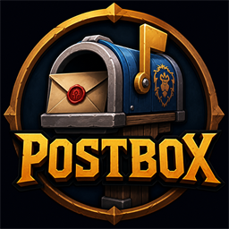

<p align="center">
  
</p>

# Postbox

A fast, self-contained replacement for the default World of Warcraft mailbox
(retail, Midnight 12.0.x–12.1). Postbox takes over when you open any mailbox and
puts everything on two tabs:

- **Collect** — the whole inbox in one list, with bulk collection that is safe by
  design: every server command is acknowledged before the next is sent, refused
  items are skipped rather than ending the run, and a run that cannot finish says
  so instead of reporting success.
- **Send** — compose with attachment slots, gold and C.O.D., a recipient box that
  completes names as you type, and guidance that tells you what will happen to a
  mail *before* you send it.

## Highlights

### Collecting
- **Collect / Done / All** views with one-click category sweeps: all mail, expired,
  sold, bought, cancelled auctions, or everything else.
- **Look before you collect** — shift-click (or right-click) opens a mail without
  taking anything; hover an attachment for its real item tooltip.
- **Stuck mail says why.** When the server refuses an item ("you already have one
  of those", full bags), the mail is marked, the row's tooltip quotes the game's
  own words, and the title bar reads "Stuck: 1" until it is resolved.
- **A finished run reports what it was worth** — gold earned and gold spent, once,
  in chat.
- **Compact rows** option: single-line mail rows, roughly half again as many mails
  visible in the same window.

### Sending
- **Inline name completion** — start typing and the best match completes in place;
  Tab accepts, Tab again cycles, Escape restores what you typed.
- **A recipient system that means what it says**: Recent (in recency order), Alts,
  Friends (including Battle.net), Guild — a name appears in every list it belongs
  to. Favourite anyone with a right-click; hide anyone with shift+right-click.
- **A recipient manager** (`/postbox recipients`, works anywhere) to curate the
  lot: search, sort, favourite, hide, annotate, and prune stored entries.
- **Send guidance, never send blocking** — a line above the Send button says
  whether the mail arrives instantly or in an hour, and warns when a cross-realm
  send cannot carry what you attached. You can always send anyway.
- **The window grows with your message** — typing past the bottom of the message
  box makes the window taller a line at a time, and shorter as you delete. Your
  saved size is never touched.

### The window
- Movable, resizable, remembers its place; optional grid docking reserves space so
  other windows arrange themselves around it.
- The mail list is guaranteed a readable number of rows at any size, and every
  control stays legible at any window opacity.

## Host UI skins (optional)

- **[EllesmereUI](https://github.com/EllesmereGaming/EllesmereUI)** — Postbox
  registers with EllesmereUI's skinning API (shipped in 8.6.8) so the window is
  painted by EllesmereUI itself: your profile's fill and transparency, accent
  colour, UI font and window border, all following live changes. On 8.6.6/8.6.7 a
  built-in compatibility backend produces the same look; the switch is automatic
  when you update. Turning Postbox off under *Blizz UI Enhanced → Blizzard Window
  Skins → Third-Party Addons* is respected — Postbox steps aside rather than
  imitating the skin.
- **[ElvUI](https://www.tukui.org/elvui)** — restyles to match your ElvUI theme,
  using the WindTools shadow/glow border when present.

With neither installed, Postbox uses its own theme and the skin code never runs.
With both, EllesmereUI wins. `/postbox skin` reports what was detected and why.

## Options

The cog button (top-left) opens a compact options panel: window border and size,
background opacity (or *Match EllesmereUI*), grid docking, tab counts, compact
mail rows, and click-to-open mail.

## Installation

From CurseForge or your addon manager, or manually: copy the `Postbox` folder into

```
World of Warcraft\_retail_\Interface\AddOns\
```

and enable **Postbox** in the AddOns list. No dependencies — everything Postbox
needs is bundled.

## Languages

English, Français, Deutsch, Español and Русский. Corrections and additional
languages are welcome — the strings live in `Core/Locales.lua` and fall back to
English per key, so partial translations are safe to contribute.

## Slash commands

| Command | Effect |
|---|---|
| `/postbox recipients` | Open the recipient manager (works away from a mailbox). |
| `/postbox skin` | Report detected host UI, active skin backend and resolved styling. |

## Notes

- Saved variables are **account-wide** (`PostboxDB` in
  `WTF\Account\<account>\SavedVariables\Postbox.lua`): recipient curation, saved
  alts and window layout are shared by every character. The character you are
  playing is automatically left out of recipient lists.
- Opening any mailbox shows Postbox; closing it restores normal play.

## For the curious

| File | Contents |
|---|---|
| [ELLESMEREUI_SKINNING.md](ELLESMEREUI_SKINNING.md) | The EllesmereUI integration: the skinning API, the two-backend pattern, and the traps found along the way. |
| [COMBAT_TAINT.md](COMBAT_TAINT.md) | The in-combat mailbox taint story: cause, mitigations, and what remains. |
| [CHANGELOG.md](CHANGELOG.md) | What changed, in plain words. |
