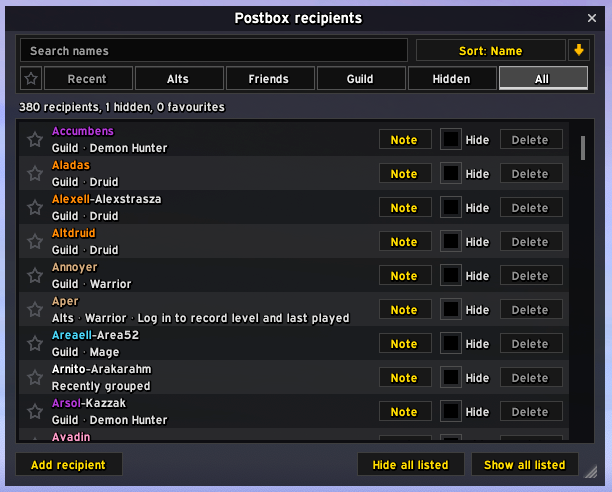
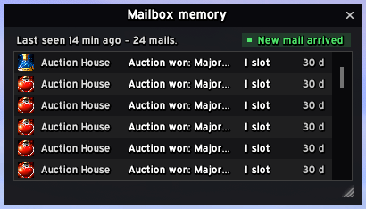
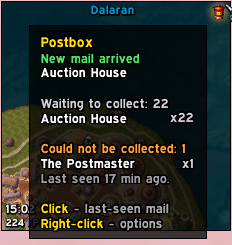
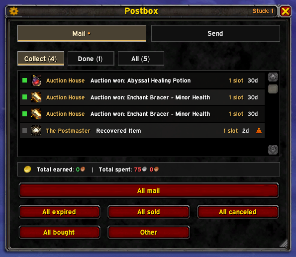
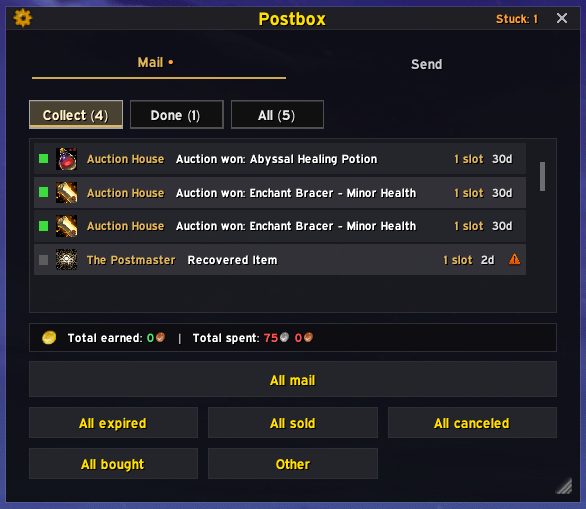

  

**A modern, lightweight replacement for the World of Warcraft mailbox.** One window
that opens at any mailbox, clears a full inbox in one pass, and remembers everyone
you write to.

Retail only (12.0.7–12.1.x). No dependencies, no libraries, nothing to configure —
install it and open a mailbox.

  
  

  <em>A full inbox cleared in one pass &nbsp;·&nbsp; composing, with completion and guidance</em>

## What it does

- **Empties a full mailbox in one click, safely.** Every server command is confirmed
  before the next is sent, bag space is checked before anything is opened, and items
  the game refuses are counted and explained in its own words rather than skipped
  quietly.
- **Keeps the books.** A running total of what a run earned and what it spent —
  proceeds, postage and C.O.D. together.
- **Knows who you mail.** Names complete in place as you type — Tab accepts. Recent
  correspondents, alts, friends (Battle.net included) and guildmates are one click
  away, favourites get a star, and a manager window curates the lot.
- **Attaches items the moment you click them.** Right-click anything in your bags
  while composing and it lands in the mail. Unmailable items wear a padlock in your
  bags while you compose. An option extends the same click to the Mail tab, so an
  item can be aimed at a new mail without leaving the one you are reading.
- **Remembers what was in the box.** Left-click the minimap icon anywhere in the
  world to see what your mailbox held when you last opened it — with an honest
  "last seen 2 h ago" header. It never pretends to be live.
- **Replaces the minimap mail icon**, if you want it to — more than two dozen
  hand-painted styles at four sizes, on the map edge or detached anywhere on screen.
- **Wears your UI.** EllesmereUI and ElvUI are followed live; without either, choose
  Blizzard-native or the flat **Postbox Modern**. You can pick Postbox's own look
  even when a UI pack is installed.

  
  

  <em>Every name you can write to, curated &nbsp;·&nbsp; what the box held, hours later</em>

## Collecting

Three views — Collect, Done, All — with one-click sweeps that pick out a single kind
of mail: expired, sold, bought, cancelled, or everything else. A search box narrows
the list by sender or subject, and while it is on the big button collects only what
is shown. Shift-click and ctrl-click pick rows the way a file manager does, and the
button collects just those. Right-click a mail to look inside without collecting;
hover an attachment for its real item tooltip; gold in a mail is a coin tile you can
take on its own; return a player's mail from the same view. The window resizes a row
at a time, so the list never shows part of a row at any size. Auction mail shows the
item's name with "AH Won" or "AH Sold" in its own colour rather than "Auction won:" three times a
screen. Compact rows fit half again as many mails in the same window.

A banner under the list keeps a running **total earned and total spent** — proceeds,
postage and C.O.D. charges — and the finished run repeats it in chat.

**Bag space is checked before the run starts.** If nothing will fit, Postbox says so
and stops before a single mail is marked read; if only part of it fits, it offers to
collect exactly that much and says how many. The offer is verified by fingerprint
when you accept, so a mailbox that reindexes while the dialog is open still collects
the mail the dialog described.

When the game refuses an item — you already have one, it is unique, you cannot carry
more — that mail is **marked and counted rather than skipped quietly**. The title bar
keeps a `Stuck: 2` tally, the row carries the reason, and where the game supplied one
Postbox quotes it instead of guessing. The count follows through to the mailbox
memory, so it is still there hours later.

## Sending

Attachment slots, gold and C.O.D., with a guidance line that says what will happen
*before* you send — instant or delayed, and whether a cross-realm send can carry what
you attached. Nothing is ever blocked: Postbox advises, you decide. A failed send
keeps your draft. The window grows as your message does and shrinks back as you
delete, without touching your saved size.

Start typing a name and it completes in place; that completion is already the
answer. Tab steps to the next suggestion, and every press after walks down the
list one row at a time (Shift+Tab walks back up); Escape puts back what you
typed, Enter takes the name whole — capital, realm and all — and moves on to
Subject. Leave the subject empty and the mail is titled after its first item,
as the game's own send window does it; the box shows the title it will use. Names in any
alphabet: Cyrillic and accented names complete, sort and favourite like any
other, and a lowercase "ив" finds Иван. An option keeps the recipient in place
after a send, for a run of mails to the same character.

**More than twelve items?** Keep right-clicking. The label counts up
("Attachments 12/12"); once the slots are full, items queue up in a grid of small
icons beside the slots, in the order they will go (right-click one to take it out;
queued items are greyed in your bags), and the Send button reads "Send 3 mails". One press posts them all, as further mails to the same
person, twelve items to each; the "Cost" line is the postage for all of them, and
Send asks once — how many mails, to whom, how many items, what postage — before a
run begins. The button counts the run off ("Sending 2 of 3..."). If the game has to
ask about an item before it is attached (one you could still return, say), it asks
when that item's turn comes, exactly as it would for a right-click; such items are
marked "asks first" in the queue's tooltip, and the line above the button says
which item is waiting on you. Right-click the queued count to clear the queue;
nothing leaves your bags. Ctrl+Enter sends from any field. An unsent draft survives
closing the mailbox, too — the text is back at the next one.

## Recipients

Categories mean what they say: Recent is in recency order, Guild is your guild,
Friends includes Battle.net. Right-click favourites a name anywhere; hiding one
removes it from every suggestion. The manager (`/postbox rm`, works away from any
mailbox) does the housekeeping: search, sort, favourite, hide, annotate.

## The minimap icon

Optional, and off until you ask for it. It replaces the default "you have mail"
indicator with one of more than two dozen hand-painted styles, at four sizes, placed
by shift-drag on the minimap rim or detached anywhere on screen — with an accent
tint, a soft glow, and a flash when new mail arrives.

Hovering it says what has arrived since you last looked, what is waiting broken down
by sender, and what could not be collected. Under EllesmereUI's minimap it restyles
*their* icon in place rather than adding a second one beside it, and switching the
feature off restores everything exactly as it was.

 

## Settings

One panel, from the cog in the title bar or a right-click on the minimap icon.
Nothing in it is required reading — Postbox is meant to work before you open it — but
it is where the window becomes yours. In the panel's own order:

**Mail tab.** Compact mail rows, which fit half again as many mails on screen. Mail
counts on the tabs. Whether the All view is offered beside Collect and Done, and
whether the five category buttons sit under the list or only the one Collect
button does. Whether a left-click opens a mail or collects it. The Mail tab's
caption: counts, a running total, a single dot, or nothing at all.

**Send tab.** Whether right-clicking a bag item while reading mail attaches it, and
whether the recipient stays in place after a send. The recipient manager opens from
here, with its count.

**Window.** Grid docking, then **Window style**, which picks who paints Postbox: your
UI pack, Blizzard-native, or Postbox Modern. A badge on that heading says which is happening —
a green dot for *Inheriting EllesmereUI settings*, a neutral one for *Overriding
EllesmereUI* — so it is never ambiguous where the look is coming from. **Border,
border size and background opacity** belong to whichever style is painting; under a
UI pack they default to matching it, so a change to your pack's borders or
transparency carries here untouched, and Postbox Modern brings its own three.

**Mail alerts.** A sound when mail arrives, a flash on the minimap icon, and whether
the mailbox memory is kept at all.

**Minimap.** The icon on or off, its style from more than two dozen, its size, where
it sits, and whether it takes your accent colour, a glow, a shadow or a pulse while
mail waits.

 

## Choose your look

The screenshots above are Postbox following EllesmereUI. Without a UI pack — or with
one, if you'd rather — it has two looks of its own:

  
  

  <em>Blizzard-native, warm and familiar &nbsp;·&nbsp; Postbox Modern, flat and near-black</em>

## Slash commands

| | |
|---|---|
| `/postbox` | The help text. |
| `/postbox rm` | The recipient manager (also `recipients`). |
| `/postbox minimap` | Toggle the minimap icon. |
| `/postbox skin` | What host UI was detected, and which skin claimed the window. |
| `/postbox debug` | A copyable report to paste into a bug report — your settings, your window, anything else installed that touches mail or bags, and any Postbox errors this session. No character name, no full addon list. |

## How it's built

**No libraries.** `Lib/` is a small hand-rolled foundation — saved-variable store,
event bus, string and formatting helpers, an inventory-lock overlay, and three UI
primitives (theme, window, dropdown). Nothing is embedded, so there is no Ace, no
LibStub, and no version negotiation with whatever else you have installed.

**Taint-clean by construction.** Postbox never touches Blizzard's mail code. It draws
its own window and talks to the mail API directly, so no protected frame is hooked
and no execution path of ours can taint one. The one residual case — the default
`MailFrame` on a second in-combat open — is documented in
[COMBAT_TAINT.md](COMBAT_TAINT.md) rather than papered over.

**Nothing runs when nothing is happening.** No repeating timers of any kind, and no
persistent `OnUpdate`: the four that exist are each scoped to a gesture — minimap
drag, window resize, dropdown scrollbar drag, and the compose box's cursor-follow,
which clears itself on the first frame it runs. Inbox
refreshes are marked and drained once per frame rather than per event, the chatty
social events are registered only while the compose tab is visible, and mailbox
memory writes saved variables once per visit.

**One skinning contract, three skins.** A skin claims `ns.Skin` at login and answers
`Apply`/`Refresh` over tagged children, so every window that knows how to be skinned
is skinnable by all three for free. EllesmereUI is followed through its own API
(8.6.8+, with a fallback for older builds) including live profile switches; ElvUI
matches your theme, WindTools borders included; Postbox Modern is a first-party flat
skin on the same contract. See [ELLESMEREUI_SKINNING.md](ELLESMEREUI_SKINNING.md)
for the integration in depth.

**Blizzard's dropdown and menu APIs are deliberately avoided** — a known taint vector
from a mail window. Postbox rolls its own.

## Languages

English, Français, Deutsch, Español, Русский, 简体中文 — complete, not partial. Strings live in
`Core/Locales.lua` and fall back to English per key, so corrections and new languages
are safe to contribute piecemeal. Counted strings are declared as plural families
with per-locale rules (Russian selects one/few/many; French counts zero as one)
rather than by gluing an "s" on the end.

## Installation

From CurseForge, Wago or your addon manager — or manually: copy the `Postbox` folder
into `World of Warcraft\_retail_\Interface\AddOns\` and enable it in the AddOns list.

Settings are account-wide.

## For the curious

| | |
|---|---|
| [CHANGELOG.md](CHANGELOG.md) | What changed, in plain words. |
| [ELLESMEREUI_SKINNING.md](ELLESMEREUI_SKINNING.md) | The EllesmereUI integration, in depth. |
| [COMBAT_TAINT.md](COMBAT_TAINT.md) | The in-combat mailbox taint story. |

Licensed under [GPL v3](LICENSE).
