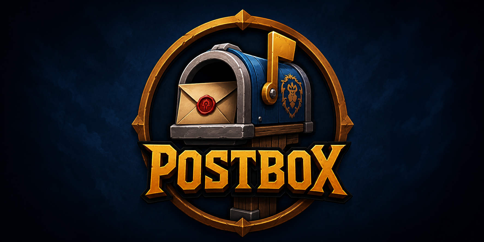
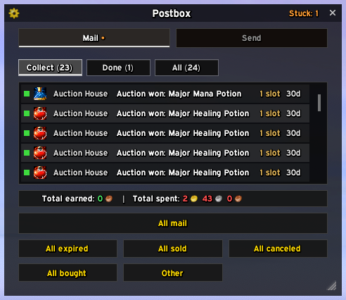
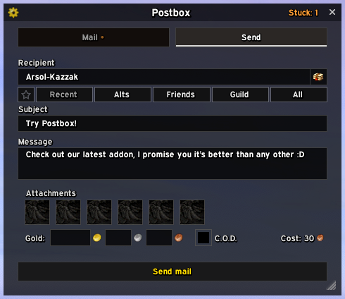
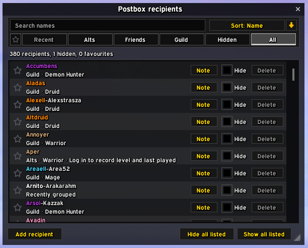
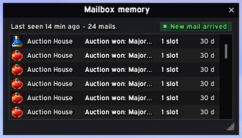
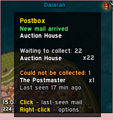
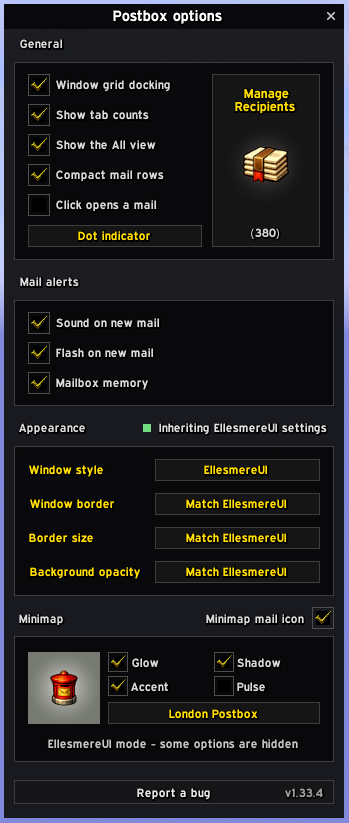
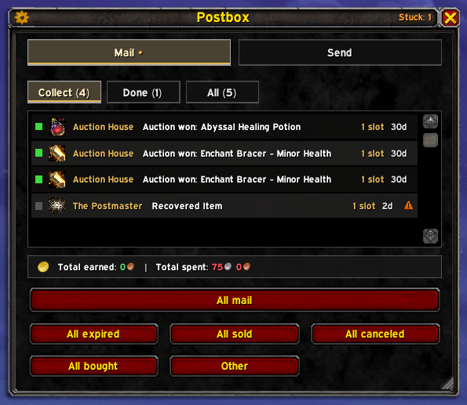
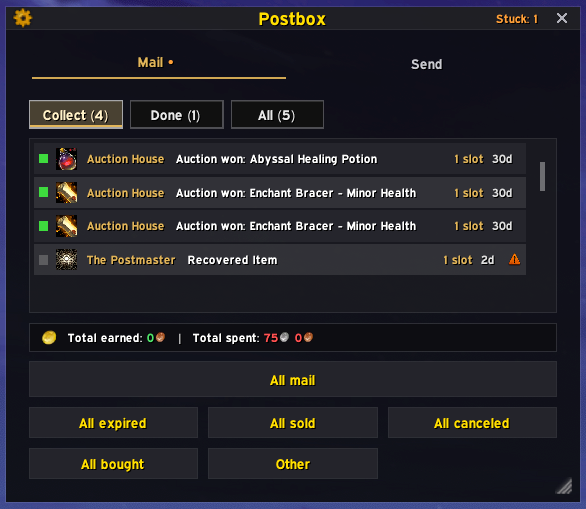

  

**A modern, lightweight replacement for the World of Warcraft mailbox.** One window
that opens at any mailbox, clears a full inbox in one pass, and remembers everyone
you write to.

Retail only (12.0.7–12.1.x). No dependencies, no libraries, nothing to configure —
install it and open a mailbox.

  
  

  <em>A full inbox cleared in one pass &nbsp;·&nbsp; composing, with completion and guidance</em>

## What it does

- **Empties a full mailbox in one click, safely.** Every server command is confirmed
  before the next is sent, bag space is checked before anything is opened, and items
  the game refuses are counted and explained in its own words rather than skipped
  quietly.
- **Keeps the books.** A running total of what a run earned and what it spent —
  proceeds, postage and C.O.D. together — and a History of what each character
  collected, letters included, for a week or up to a month.
- **Knows who you mail.** Names complete in place as you type — Tab accepts. Recent
  correspondents, alts, friends (Battle.net included) and guildmates are one click
  away, favourites get a star, and a manager window curates the lot.
- **Attaches items the moment you click them.** Right-click anything in your bags
  while composing and it lands in the mail; Alt+right-click takes every stack of it.
  Unmailable items wear a padlock in your bags while you compose. An option extends
  the same click to the Mail tab, so an item can be aimed at a new mail without
  leaving the one you are reading.
- **Remembers every character's mailbox.** Mail Memory keeps what each character's
  box held when it last opened one: look any of them up from the minimap icon
  anywhere in the world, or show an alt's box right in the Mail tab. It searches
  every character at once and warns before mail on one you have not played in a
  while is lost. Every box says how long ago it was seen; it never pretends to be
  live.
- **Replaces the minimap mail icon**, if you want it to — more than two dozen
  hand-painted styles at four sizes, on the map edge or detached anywhere on screen.
- **Wears your UI.** EllesmereUI and ElvUI are followed live; without either, choose
  Blizzard-native or the flat **Postbox Modern**. You can pick Postbox's own look
  even when a UI pack is installed.

  
  

  <em>Every name you can write to, curated &nbsp;·&nbsp; every character's box, hours later</em>

## Collecting

One inbox: what still holds something first, then the read mail with nothing left
in it, folded under a divider that deletes it in one click. In a long inbox the
divider waits at the foot of the list, and scrolling down to it opens the read
mail. Rather keep it apart? Options puts it in a Done tab of its own, or deletes
each mail the moment it is finished with.

One-click sweeps pick out a single kind of mail: expired, sold, cancelled, bought,
from your alts, or everything else. A search box narrows the list by sender,
subject or what happened to it ("sold"), and while it is on the big button collects
only what is shown; clicking `Stuck: 2` in the title bar does the same for the mail
the game would not hand over. Shift-click and ctrl-click pick rows the way a file
manager does, and the button collects just those. Right-click a mail to look inside
without collecting; hover an attachment for its real item tooltip; gold in a mail is
a coin tile you can take on its own; return a player's mail from the same view.

Auction mail shows the item's name with "AH Bought" or "AH Sold" in its own colour
rather than "Auction won:" three times a screen, and crafted items wear their
quality mark. Each row's gold, slots and time left line up at its right edge, in the
order you choose. Compact rows, the default, fit half again as many mails as
two-line ones.

A banner under the list keeps a running **total earned and total spent** — proceeds,
postage and C.O.D. charges — and the finished run repeats it in chat.

**Bag space is checked before the run starts.** If nothing will fit, Postbox says so
and stops before a single mail is marked read; if only part of it fits, it offers to
collect exactly that much and says how many. The offer is verified by fingerprint
when you accept, so a mailbox that reindexes while the dialog is open still collects
the mail the dialog described.

When the game refuses an item — you already have one, it is unique, you cannot carry
more — that mail is **marked and counted rather than skipped quietly**. The title bar
keeps a `Stuck: 2` tally, the row carries the reason, and where the game supplied one
Postbox quotes it instead of guessing. The count follows through to Mail Memory,
so it is still there hours later.

## History

The clock beside Inbox lists what Postbox collected on this character, newest first:
when, from whom, what came out and what it was worth, with earned and spent totals
underneath. Letters you read are there too, and hovering one shows what it said —
even after the mail itself is gone. Search works there as well. It keeps a week by
default, up to 30 days if you ask.

## Mail Memory

Every character's mailbox, as it looked the last time that character opened one.
Away from a mailbox, the minimap icon, the minimap's addon menu or `/postbox mail`
opens it: pick a character from the list (names in class colour, with what is
waiting), sort what expires soonest to the top, or search every character's box at
once, each one's matches under its name. At a mailbox the same list sits beside the
Mail tab's search, and shows an alt's box right there beside your own.

Auctions that sell, expire or are bought while you are away appear as rows by item
until your next visit. The minimap tooltip — and one line in chat at login — names
any character with mail close to expiring, or with mail on its way and no mailbox
visit in over three weeks.

## Sending

Attachment slots, gold and C.O.D., with a guidance line that says what will happen
*before* you send — instant or delayed, and whether a cross-realm send can carry what
you attached. Nothing is ever blocked: Postbox advises, you decide. A failed send
keeps your draft. The window grows as your message does and shrinks back as you
delete, without touching your saved size.

Start typing a name and it completes in place; that completion is already the
answer. Tab steps to the next suggestion, and every press after walks down the
list one row at a time (Shift+Tab walks back up); Escape puts back what you
typed, Enter takes the name whole — capital, realm and all — and moves on to
Subject. Leave the subject empty and the mail is titled after its first item,
as the game's own send window does it; the box shows the title it will use. Names in any
alphabet: Cyrillic and accented names complete, sort and favourite like any
other, and a lowercase "ив" finds Иван. An option keeps the recipient in place
after a send, for a run of mails to the same character.

**More than twelve items?** Keep right-clicking. The label counts up
("Attachments 12/12"); once the slots are full, items queue up in a grid of small
icons beside the slots, in the order they will go (right-click one to take it out;
queued items are greyed in your bags), and the Send button reads "Send 3 mails". One press posts them all, as further mails to the same
person, twelve items to each; the "Cost" line is the postage for all of them, and
Send asks once — how many mails, to whom, how many items, what postage — before a
run begins. The button counts the run off ("Sending 2 of 3..."). If the game has to
ask about an item before it is attached (one you could still return, say), it asks
when that item's turn comes, exactly as it would for a right-click; such items are
marked "asks first" in the queue's tooltip, and the line above the button says
which item is waiting on you. Right-click the queued count to clear the queue;
nothing leaves your bags. Alt+right-click an item and every stack of it goes in:
what fits into the slots, the rest into the queue. Ctrl+Enter sends from any field.
An unsent draft survives closing the mailbox, too — the text is back at the next one.

## Recipients

Categories mean what they say: Recent is in recency order, Guild is your guild,
Friends includes Battle.net. Right-click favourites a name anywhere; hiding one
removes it from every suggestion. The manager (`/postbox rm`, works away from any
mailbox) does the housekeeping: search, sort, favourite, hide, annotate.

## The minimap icon

Optional, and off until you ask for it. It replaces the default "you have mail"
indicator with one of more than two dozen hand-painted styles, at four sizes, placed
by shift-drag on the minimap rim or detached anywhere on screen — with an accent
tint, a soft glow, and a flash when new mail arrives.

Hovering it says what has arrived since you last looked, what is waiting broken down
by sender, and what could not be collected. Under EllesmereUI's minimap it restyles
*their* icon in place rather than adding a second one beside it, and switching the
feature off restores everything exactly as it was.

 

## Settings

One panel, from the cog in the title bar or a right-click on the minimap icon.
Nothing in it is required reading — Postbox is meant to work before you open it — but
it is where the window becomes yours. In the panel's own order:

**Mail rows.** Compact or two-line rows. Where an item's crafting quality mark goes:
on its icon, after its name, both, or nowhere. The figures a row carries — gold,
slots, time left — each on or off and dragged into the order you want, with which
gold (earned, spent or both) and when the time left shows.

**Mail tab.** Counts on the tab and its buttons. Whether the six category buttons
sit under the list or only the one Collect button does. Whether a left-click opens a
mail or collects it. What happens to read mail with nothing left: under the divider,
in a Done tab, or deleted when done. How long History keeps.

**Send tab.** Whether right-clicking a bag item while reading mail attaches it, and
whether the recipient stays in place after a send. The recipient manager opens from
the top of the panel, with its count.

**Mail alerts.** A sound when mail arrives, and a flash on the minimap icon.

**Window.** Grid docking, then **Window style**, which picks who paints Postbox: your
UI pack, Blizzard-native, or Postbox Modern. A badge on that heading says which is happening —
a green dot for *Inheriting EllesmereUI settings*, a neutral one for *Overriding
EllesmereUI* — so it is never ambiguous where the look is coming from. **Border,
border size and background opacity** belong to whichever style is painting; under a
UI pack they default to matching it, so a change to your pack's borders or
transparency carries here untouched, and Postbox Modern brings its own three.

**Minimap.** The icon on or off, its style from more than two dozen, its size, where
it sits, and whether it takes your accent colour, a glow, a shadow or a pulse while
mail waits.

**Mail Memory.** On or off, and whether the login line warns about mail on your
other characters.

 

## Choose your look

The screenshots above are Postbox following EllesmereUI. Without a UI pack — or with
one, if you'd rather — it has two looks of its own:

  
  

  <em>Blizzard-native, warm and familiar &nbsp;·&nbsp; Postbox Modern, flat and near-black</em>

## Slash commands

| | |
|---|---|
| `/postbox` | The help text. |
| `/postbox rm` | The recipient manager (also `recipients`). |
| `/postbox mail` | Mail Memory: every character's mailbox. |
| `/postbox minimap` | Toggle the minimap icon. |
| `/postbox skin` | What host UI was detected, and which skin claimed the window. |
| `/postbox debug` | A copyable report to paste into a bug report — your settings, your window, anything else installed that touches mail or bags, and any Postbox errors this session. No character name, no full addon list. |

## How it's built

**No libraries.** `Lib/` is a small hand-rolled foundation — saved-variable store,
event bus, string and formatting helpers, an inventory-lock overlay, and three UI
primitives (theme, window, dropdown). Nothing is embedded, so there is no Ace, no
LibStub, and no version negotiation with whatever else you have installed.

**Taint-clean by construction.** Postbox never touches Blizzard's mail code. It draws
its own window and talks to the mail API directly, so no protected frame is hooked
and no execution path of ours can taint one. The one residual case — the default
`MailFrame` on a second in-combat open — is documented in
[COMBAT_TAINT.md](COMBAT_TAINT.md) rather than papered over.

**Nothing runs when nothing is happening.** No repeating timers of any kind, and no
persistent `OnUpdate`: the four that exist are each scoped to a gesture — minimap
drag, window resize, dropdown scrollbar drag, and the compose box's cursor-follow,
which clears itself on the first frame it runs. Inbox
refreshes are marked and drained once per frame rather than per event, the chatty
social events are registered only while the compose tab is visible, and Mail
Memory writes its snapshot once per visit.

**One skinning contract, three skins.** A skin claims `ns.Skin` at login and answers
`Apply`/`Refresh` over tagged children, so every window that knows how to be skinned
is skinnable by all three for free. EllesmereUI is followed through its own API
(8.6.8+, with a fallback for older builds) including live profile switches; ElvUI
matches your theme, WindTools borders included; Postbox Modern is a first-party flat
skin on the same contract. See [ELLESMEREUI_SKINNING.md](ELLESMEREUI_SKINNING.md)
for the integration in depth.

**Blizzard's dropdown and menu APIs are deliberately avoided** — a known taint vector
from a mail window. Postbox rolls its own.

## Languages

English, Français, Deutsch, Español, Русский, 简体中文, 繁體中文 — complete, not partial. Strings live in
`Core/Locales.lua` and fall back to English per key, so corrections and new languages
are safe to contribute piecemeal. Counted strings are declared as plural families
with per-locale rules (Russian selects one/few/many; French counts zero as one)
rather than by gluing an "s" on the end.

## Installation

From CurseForge, Wago or your addon manager — or manually: copy the `Postbox` folder
into `World of Warcraft\_retail_\Interface\AddOns\` and enable it in the AddOns list.

Settings are account-wide.

## For the curious

| | |
|---|---|
| [CHANGELOG.md](CHANGELOG.md) | What changed, in plain words. |
| [ELLESMEREUI_SKINNING.md](ELLESMEREUI_SKINNING.md) | The EllesmereUI integration, in depth. |
| [COMBAT_TAINT.md](COMBAT_TAINT.md) | The in-combat mailbox taint story. |

Licensed under [GPL v3](LICENSE).
